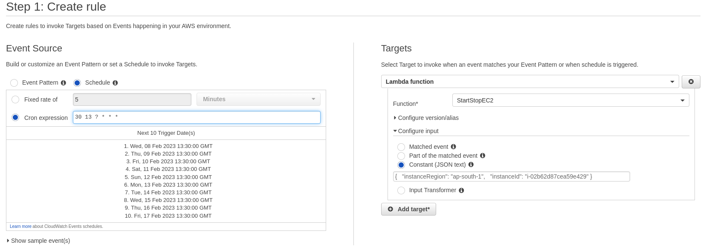

## Deployment instructions

* 1. Create IAM Policy & Role
* 2. Create Lambda function 
* 3. Create CloudWatch Event

 1. Create IAM Policy 

```bash
{
    "Statement": [
        {
            "Action": [
                "rds:StartDBCluster",
                "rds:StopDBCluster",
                "ec2:DescribeInstances",
                "rds:ListTagsForResource",
                "ec2:DescribeInstanceTypeOfferings",
                "ec2:StartInstances",
                "ec2:DescribeTags",
                "logs:*",
                "rds:DescribeDBInstances",
                "rds:DescribeDBClusters",
                "rds:StopDBInstance",
                "ec2:StopInstances",
                "rds:StartDBInstance"
            ],
            "Effect": "Allow",
            "Resource": "*",
            "Sid": "VisualEditor0"
        }
    ],
    "Version": "2012-10-17"
}
```

Create IAM Role and attach previous created Policy

 2. Create Lambda function 

* Runtime = Node.js 14.x
* HandlerInfo = StartStopEC2.handler

StartStopEC2.js
```nodejs

// StartStopEC2Instance

const AWS = require('aws-sdk');

exports.handler = (event, context, callback) => {
    const ec2 = new AWS.EC2({ region: event.instanceRegion });
    
    ec2.startInstances({ InstanceIds: [event.instanceId] }).promise()
        .then(() => callback(null, `Successfully started ${event.instanceId}`))
        .catch(err => callback(err));
};
```

Attach Execution IAM role and Permission on Lambda function

3. Create CloudWatch Event for Cronjob



Cron expression is based on UTC

Simple Constant (JSON text)
```
{
  "instanceRegion": "ap-south-1",
  "instanceId": "i-02b62d87cea59e419"
}
```